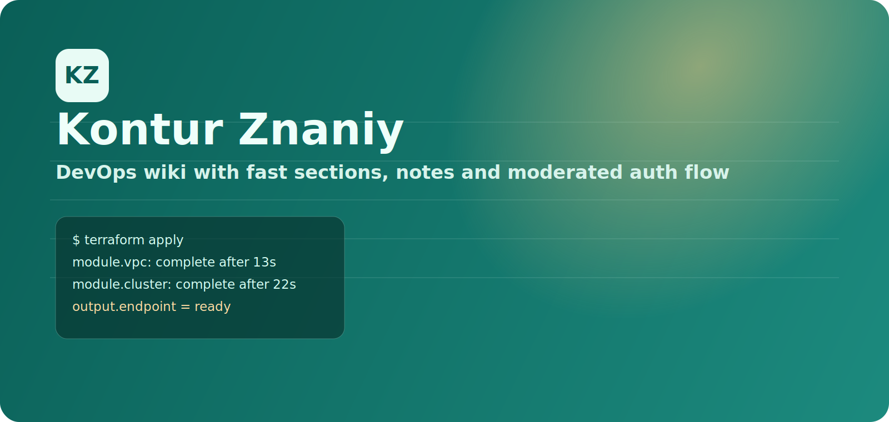
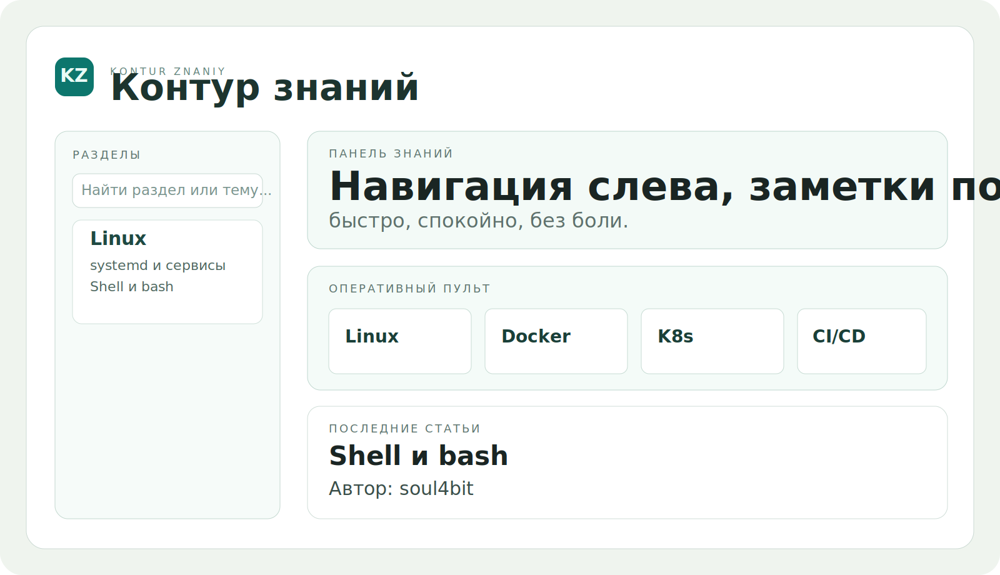

# Контур знаний

<p align="center">
  
</p>

<p align="center">
  
</p>

Self-hosted DevOps wiki для команды: статьи, runbook-заметки, роли доступа и админка с модерацией.

## Что внутри

- Регистрация через модерацию (Telegram) + подтверждение email.
- Роли пользователей:
  - `viewer` — только просмотр.
  - `editor` — создание/редактирование/удаление статей.
  - `admin` — полный доступ + управление пользователями.
- Админка `/app/admin/users`:
  - одобрение/отклонение заявок,
  - смена ролей,
  - блокировка/разблокировка,
  - удаление аккаунтов,
  - журнал действий админа.
- Антибрут для login/register (rate limit по IP/email).
- Уникальные ники на уровне БД.
- Статьи в Markdown:
  - toolbar,
  - write/preview,
  - ссылки, картинки, чеклисты, таблицы, code-block,
  - рендер Markdown в ленте и в карточке статьи.
- История версий статей и восстановление версии (только для admin).
- PostgreSQL + автоприменение миграций при старте.

## Интерфейс

<p align="center">
  
</p>

<p align="center">
  
</p>

## Стек

- Go (`net/http`, `html/template`)
- PostgreSQL (`database/sql`, `pgx`)
- Vanilla CSS + JS
- Telegram Bot API + SMTP для регистрационного флоу

## Быстрый старт

1. Поднимите PostgreSQL (локально/в контейнере).
2. Создайте `.env` из примера:

```bash
cp .env.example .env
```

3. Заполните минимум:
- `DATABASE_URL`
- `SMTP_*` / `MAIL_FROM`
- `TELEGRAM_BOT_TOKEN`
- `TELEGRAM_ADMIN_CHAT_ID`

4. Запустите приложение:

```bash
go mod download
go run ./cmd/server
```

После запуска приложение доступно на `http://localhost:8080`.

## Основные маршруты

- `/auth/login` — вход
- `/auth/register` — регистрация
- `/app` — дашборд
- `/app/section?slug=linux` — раздел
- `/app/article?id=<id>` — просмотр статьи
- `/app/article/new?section=linux` — новая статья
- `/app/admin/users` — админка

## Как выдать первого админа

Если в системе ещё нет администратора, выдайте роль напрямую в БД:

```sql
update users
set role = 'admin'
where email = 'you@example.com';
```

## Деплой

- workflow: `.github/workflows/deploy.yml`
- target path на сервере: `/var/www/kontur-znaniy`

## Roadmap

- Экспорт статей в `.md`/архив.
- Импорт/экспорт базы знаний между окружениями.
