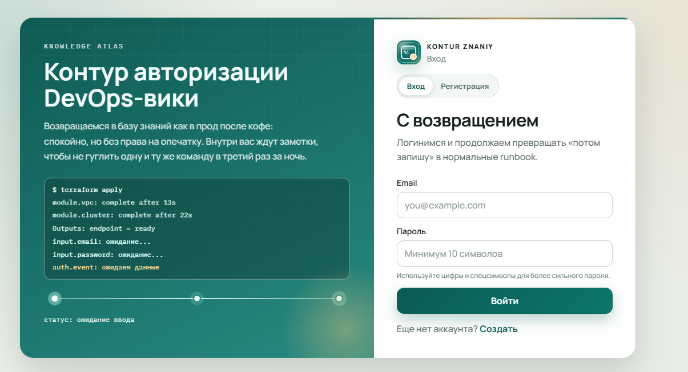
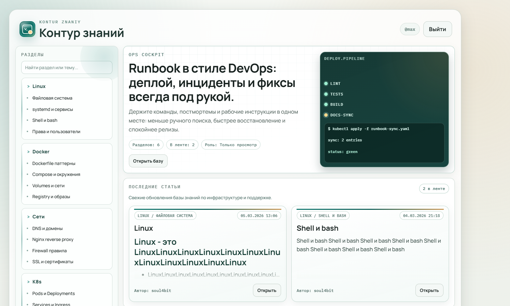

# Контур знаний

<p align="center">
  
</p>

<p align="center">
  
</p>

Self-hosted DevOps wiki для внутренней команды: структурированные разделы, статьи в Markdown, ролевой доступ, модерация регистрации и админ-панель.

## Возможности

- Авторизация:
  - вход/выход с сессионными cookie
  - регистрация с модерацией через Telegram
  - подтверждение email перед активацией аккаунта
- Роли:
  - `viewer` (только просмотр)
  - `editor` (создание/редактирование/удаление статей)
  - `admin` (полный доступ и управление пользователями)
- Статьи:
  - Markdown-редактор с toolbar и превью
  - автосохранение черновиков для создания/редактирования
  - загрузка изображений (S3-совместимое хранилище)
  - комментарии с проверкой прав на удаление
- Админ-панель (`/app/admin/users`):
  - одобрение/отклонение заявок на регистрацию
  - смена ролей пользователей
  - блокировка/разблокировка пользователей
  - удаление пользователей
  - журнал действий администратора
- Безопасность:
  - CSRF-защита для изменяющих действий
  - rate limiting для login/register
  - хеширование паролей через bcrypt

## Стек

- Go (`net/http`, `html/template`)
- PostgreSQL (`database/sql`, `pgx`)
- Vanilla CSS + JavaScript
- Telegram Bot API (модерация регистрации)
- SMTP (подтверждение email)
- S3-совместимое объектное хранилище (медиа)

## Требования

- Go 1.22+ (или совместимый современный Go toolchain)
- PostgreSQL 14+
- SMTP-аккаунт
- Telegram bot token и admin chat ID
- Опционально: S3-совместимый bucket для загрузки медиа

## Быстрый старт

1. Скопируйте env-файл:

```bash
cp .env.example .env
```

2. Заполните обязательные переменные в `.env`:

- `DATABASE_URL`
- `SMTP_HOST`, `SMTP_PORT`, `SMTP_USER`, `SMTP_PASSWORD`, `MAIL_FROM`
- `TELEGRAM_BOT_TOKEN`, `TELEGRAM_ADMIN_CHAT_ID`
- опционально для медиа:
  - `S3_ENDPOINT`, `S3_BUCKET`, `S3_ACCESS_KEY`, `S3_SECRET_KEY`, `S3_PUBLIC_BASE_URL`

3. Запуск:

```bash
go mod download
go run ./cmd/server
```

4. Откройте:

`http://localhost:8080`

## Основные маршруты

- `/auth/login`
- `/auth/register`
- `/auth/verify-email?token=...`
- `/app`
- `/app/section?slug=linux`
- `/app/article?id=<id>`
- `/app/article/new?section=linux`
- `/app/admin/users`

## Как назначить первого администратора

Если в системе ещё нет администратора, назначьте роль вручную:

```sql
update users
set role = 'admin'
where email = 'you@example.com';
```

## Тесты

```bash
go test ./...
```

## Деплой

- workflow GitHub Actions: `.github/workflows/deploy.yml`
- пример service unit: `deploy/kontur-znaniy.service`

## Интерфейс

<p align="center">
  
</p>

## Первый релиз (v1.0.0)

Репозиторий готов к первой публичной релизной версии.

1. Закоммитьте текущие изменения:

```bash
git add -A
git commit -m "release: v1.0.0"
```

2. Создайте тег:

```bash
git tag -a v1.0.0 -m "First stable release"
```

3. Запушьте ветку и тег:

```bash
git push origin main
git push origin v1.0.0
```

4. Опубликуйте GitHub Release:

- откройте `https://github.com/soul4bit/kontur-znaniy/releases/new`
- выберите тег `v1.0.0`
- используйте заметки из `CHANGELOG.md`
- опубликуйте релиз
